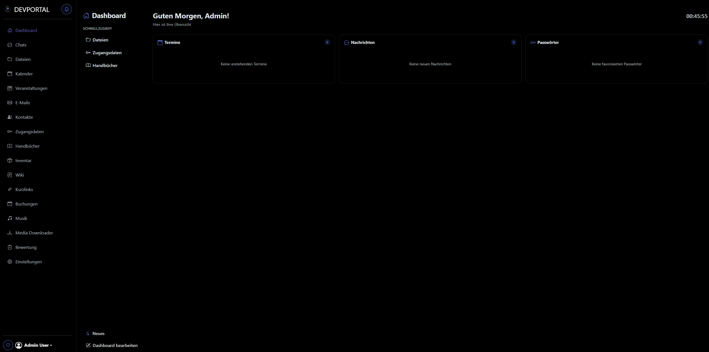
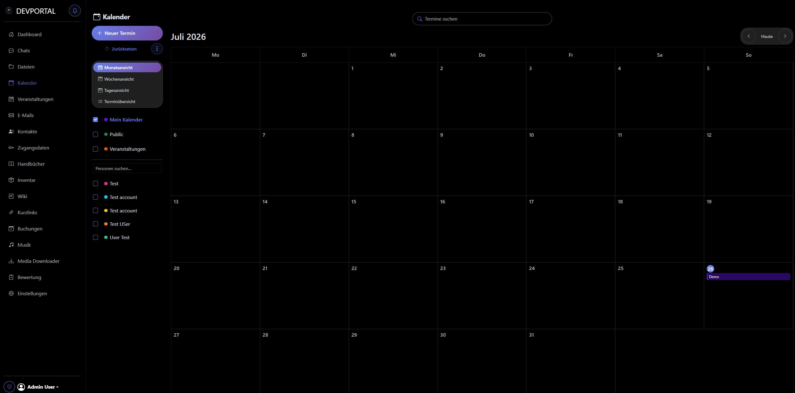
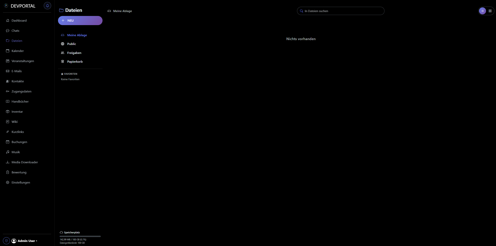
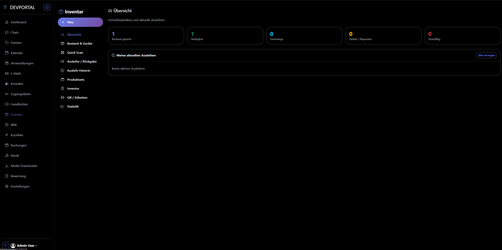
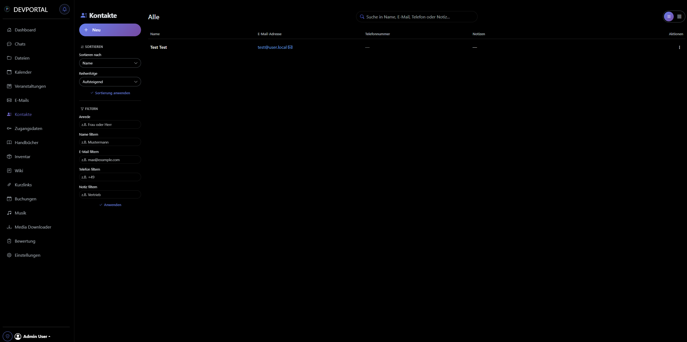
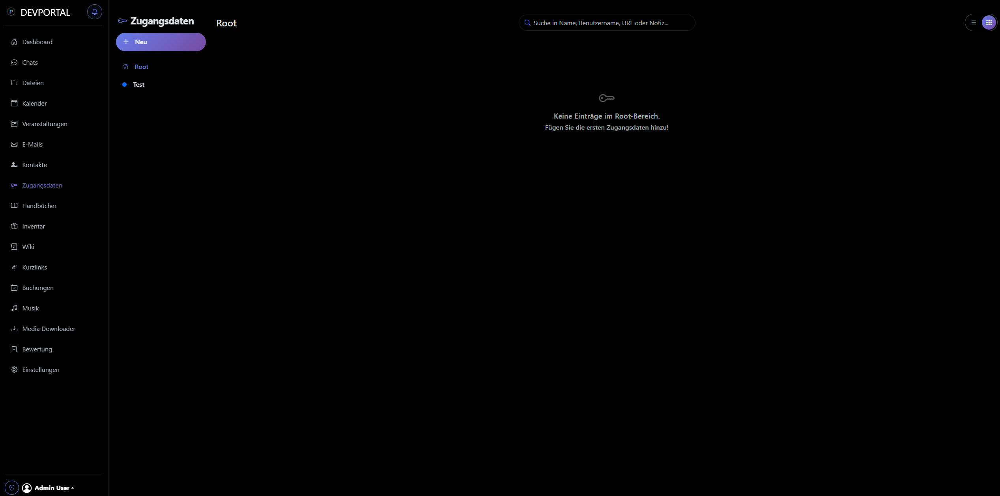
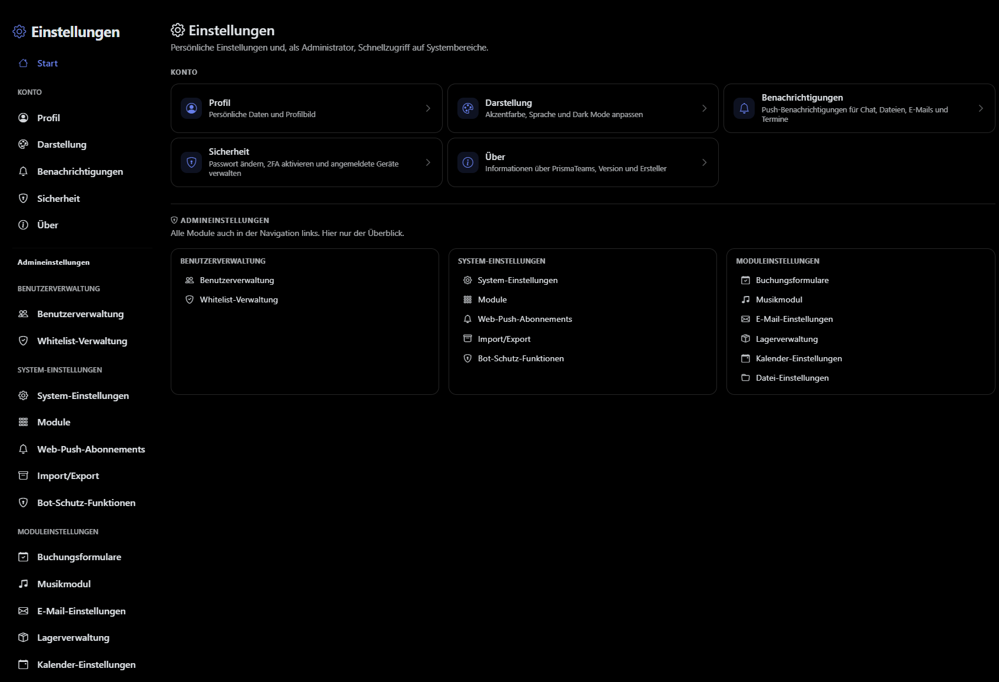
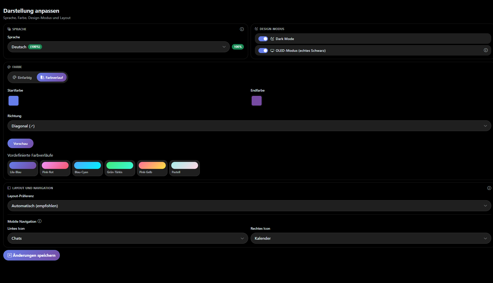

<p align="center">
  
</p>

<h1 align="center">Prismateams</h1>

<p align="center">
  <strong>Team-Portal · Version 3.0.1</strong><br>
  Modernes, modulares Web-Portal für Teams – Flask · Bootstrap · Mobile-First
</p>

<p align="center">
  
  
  
  
  
</p>

<p align="center">
  <a href="#-neu-in-301">Neu in 3.0.1</a> ·
  <a href="#-screenshots">Screenshots</a> ·
  <a href="#-module">Module</a> ·
  <a href="#-installation">Installation</a> ·
  <a href="#-dokumentation">Dokumentation</a>
</p>

---

## Überblick

Prismateams ist ein webbasiertes Team-Portal mit einheitlicher Designsprache, modularem Aufbau und starker Mobile-Unterstützung. Module lassen sich gezielt aktivieren – von Chat und Dateien über Kalender und Inventar bis zu Events, Buchungen und Bewertung.

> **Schulprojekt / Disclaimer**  
> Portal und Dokumentation wurden teilweise mit Cursor und KI-Tools erstellt. Fehlerhafte Doku oder Bugs können vorkommen. Keine Haftung für Sicherheitslücken, Fehlverhalten oder Datenverlust – Nutzung auf eigene Gefahr.

---

## Neu in 3.0.1

PrismaTeams 3 bringt frisches Design, neue Module und mehr Sicherheit für den Alltag im Team.

| Bereich | Highlights |
|--------|------------|
| **Design** | Einheitliche Oberfläche, OLED-Modus, Farbverläufe, überarbeitete Navigation |
| **Dashboard** | Widgets, Schnellzugriff, „Neues“-Overlay pro Version |
| **Sicherheit** | 2FA (TOTP), Rate-Limiting, Bot-Schutz, Session-Tracking, Gast-Accounts |
| **Dateien** | Private Bereiche, Quotas, Favoriten, Soft-Locks, Dropbox-Mode |
| **Kalender** | Multi-Kalender, Tagesansicht, externe Sync, Kontextmenüs |
| **Inventar** | Checkout-System, Event-Verknüpfung, erweiterte Produktfelder |
| **Neu** | Veranstaltungen, Bewertung, Musik, Shortlinks, Media Downloader |

---

## Screenshots

<p align="center">
  
  <br><em>Dashboard – Desktop</em>
</p>

<p align="center">
  
  <br><em>Dashboard – Mobile</em>
</p>

<table>
  <tr>
    <td width="50%" align="center">
      <br>
      <em>Kalender</em>
    </td>
    <td width="50%" align="center">
      <br>
      <em>Dateien</em>
    </td>
  </tr>
  <tr>
    <td width="50%" align="center">
      <br>
      <em>Inventar</em>
    </td>
    <td width="50%" align="center">
      <br>
      <em>Kontakte</em>
    </td>
  </tr>
  <tr>
    <td width="50%" align="center">
      <br>
      <em>Zugangsdaten</em>
    </td>
    <td width="50%" align="center">
      <br>
      <em>Einstellungen</em>
    </td>
  </tr>
</table>

<p align="center">
  
  <br><em>Darstellung – Dark Mode, OLED, Farbverläufe, Layout</em>
</p>

---

## Features

- **Mobile-First** – Sidebar Desktop, Bottom-Nav Mobile
- **Modulare Architektur** – Module an/aus per Admin
- **Echtzeit** – WebSocket / Socket.IO, optional Redis
- **Push** – Web Push (VAPID), Service Worker
- **API** – REST unter `/api/` für Apps und Integrationen
- **Sicherheit** – Argon2, Fernet, 2FA, Rollen & Modulrechte
- **Personalisierung** – Dark/OLED, Akzentfarben & Verläufe
- **i18n** – u. a. Deutsch, Englisch, Portugiesisch, Spanisch, Russisch
- **Optional** – OnlyOffice, Media Downloader
- **Setup** – Assistent; modularer Ubuntu-Installer (produktionstauglich)
- **Updates** – Migrationsskripte unter `migrations/`

---

## Module

| Modul | Beschreibung |
|-------|--------------|
| **Dashboard** | Widgets, Schnellzugriff, personalisierbare Startseite |
| **Chats** | Team-/Gruppen-/Direktchats, Pins, Medien, Push |
| **Dateien** | Ordner, Versionen, Quotas, Freigaben, OnlyOffice (opt.) |
| **Kalender** | Multi-Kalender, Sync, iCal, Tages-/Monatsansicht |
| **Veranstaltungen** | Termine, Zuweisungen, Bedarf, Scanner, PDF |
| **E-Mail** | IMAP/SMTP, Rechte pro User, HTML & Anhänge |
| **Kontakte** | Team-Kontakte mit Favoriten |
| **Zugangsdaten** | Verschlüsselte Passwortverwaltung (Fernet) |
| **Handbücher** | PDF-Anleitungen mit Ordnerstruktur |
| **Inventar** | Produkte, QR, Checkout, Inventur, Event-Link |
| **Wiki** | Markdown, Versionen, Tags, Suche |
| **Buchungen** | Öffentliche Formulare, Freigabe, Nachrichten |
| **Musik** | Wünsche, Playlists, öffentliche Wishlist |
| **Shortlinks** | Kurzlinks fürs Team |
| **Media Downloader** | Medien-Downloads (optional) |
| **Bewertung** | Bewertungen, Ranking, Inspektionen |
| **Einstellungen** | Profil, Theme, Module, Admin-Tools |

---

## Tech Stack

| Schicht | Technologie |
|---------|-------------|
| Backend | Python, Flask, SQLAlchemy |
| Frontend | Bootstrap 5, Vanilla JS, CSS |
| Datenbank | MySQL / MariaDB oder SQLite |
| Echtzeit | Socket.IO, optional Redis |
| Auth | Sessions, Argon2, optional 2FA / reCAPTCHA / Turnstile |
| Deploy | Gunicorn, Nginx/Apache, Ubuntu-Skript |

**Minimal:** Python 3.8+, 2 GB RAM, 10 GB Speicher  
**Empfohlen:** Python 3.12+, MySQL/MariaDB, 4 GB+ RAM, Redis bei Multi-Worker

---

## Installation

### Ubuntu (empfohlen)

Modularer Installer – **einsatzbereit** für Produktion:

```bash
sudo bash scripts/install_ubuntu.sh
```

Details und Flags: [INSTALLATION_SCRIPT.md](INSTALLATION_SCRIPT.md) · Alternative: [manuelle Installation](INSTALLATION.md)

### Entwicklung (Kurz)

```bash
python -m venv .venv
# Windows: .venv\Scripts\Activate.ps1
# Linux/macOS: source .venv/bin/activate
pip install -r requirements.txt
cp docs/env.example .env
python app.py
```

Details:

- [INSTALLATION_SCRIPT.md](INSTALLATION_SCRIPT.md) – Ubuntu-Installer (empfohlen)
- [INSTALLATION.md](INSTALLATION.md) – manuelle Installation
- [WARTUNG.md](WARTUNG.md) – Updates, Migrationen, Backups
- [ERROR_HANDLING.md](ERROR_HANDLING.md) – Fehlerbehebung
- [env.example](env.example) – Konfigurationsbeispiel

---

## API

REST unter `/api/` – Übersicht: **[API_Übersicht.md](API_Übersicht.md)**  
Auth-Details: **[API_AUTH.md](API_AUTH.md)**

Abgedeckt u. a.: Auth, Dashboard, Chat, Dateien, Kalender, E-Mail, Inventar, Wiki, Push, WebSocket.

---

## Projektstruktur

```
Prismateams_web/
├── app/
│   ├── blueprints/          # Module (Dashboard, Chat, Files, …)
│   ├── models/              # SQLAlchemy-Modelle
│   ├── services/            # Business-Logic
│   ├── static/              # CSS, JS, Logo, Assets
│   ├── templates/           # Jinja2
│   └── utils/               # Hilfen (i18n, PDF, Push, …)
├── docs/                    # Doku & Screenshots (diese README)
│   └── Pictures/
├── migrations/              # DB-Migrationen
├── scripts/                 # install_ubuntu.sh (+ install_ubuntu/), Key-Generatoren
├── app.py                   # Dev-Einstieg
├── wsgi.py                  # Produktion
├── config.py
└── requirements.txt
```

---

## Dokumentation

| Dokument | Inhalt |
|----------|--------|
| [INSTALLATION_SCRIPT.md](INSTALLATION_SCRIPT.md) | Ubuntu-Installer (empfohlen, einsatzbereit) |
| [INSTALLATION.md](INSTALLATION.md) | Manuelle Installation |
| [WARTUNG.md](WARTUNG.md) | Updates & Backups |
| [ERROR_HANDLING.md](ERROR_HANDLING.md) | Troubleshooting |
| [API_Übersicht.md](API_Übersicht.md) | API-Endpunkte |
| [API_AUTH.md](API_AUTH.md) | API-Login, 2FA, Tokens |
| [GitHub Wiki](https://github.com/iAmCriptic/Prismateams_web/wiki) | Erweiterte Modul-Doku |

---

## Lizenz & Support

Lizenz: **Non-Commercial Share-Alike** – siehe [../LICENSE](../LICENSE).  
Interne/kommerzielle Nutzung im eigenen Betrieb ok; Verkauf/Weitervertrieb als Produkt/Service nicht. Änderungen müssen öffentlich unter gleicher Lizenz bleiben.

**Hilfe:** Doku prüfen → [Wiki](https://github.com/iAmCriptic/Prismateams_web/wiki) → Logs → [Issue](https://github.com/iAmCriptic/Prismateams_web/issues)

Beiträge willkommen (PR oder Issue).

---

<p align="center">
  <br>
  <sub>Prismateams 3.0.1 – Team-Zusammenarbeit, modular & modern</sub>
</p>
